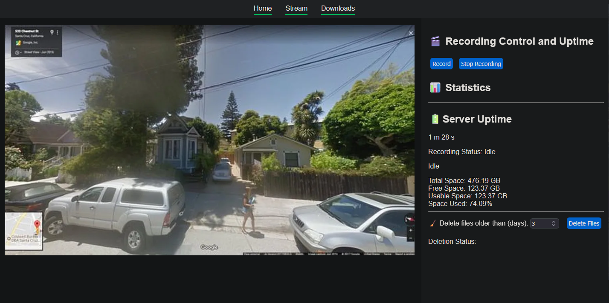

# pypicam - Stream webcam feed through http + local recording + auto cleanup

---

## Overview

-   Reads from a V4L2 video device `/dev/video99`
-   Serves an MJPEG stream directly over HTTP for multi-client access.
-   Provides a simple web interface to view live video streams and browse recorded clips.
-   Manages video recording via FFmpeg with automated segmenting into 30-minute MKV files.
-   Supports on-demand start/stop of recordings through HTTP endpoints.
-   Implements folder-based retention cleanup to automatically manage disk space.
-   Implements auto-cleanup at 20% remaining space

---

## Architecture

1. **/dev/video0 mirroring\***
   First we mirror the /dev/video0 device on /dev/video98 and 99, one for streaming, one for recording.

2. **Video Capture**  
   Uses a wrapper for v4l2 api and reads the frame data from that

3. **Python/fastapi HTTP Server**

    - Serves live MJPEG streams efficiently to multiple clients on `/stream`.
    - Hosts a basic UI homepage and video listing page.
    - Exposes RESTful endpoints for starting/stopping recording sessions.
    - Streams recorded video clips for download.
    - Serves static assets (CSS, JS) from a dedicated folder.

4. **FFmpeg Integration**
    - Launches and manages FFmpeg as an external process.
    - Segments recordings into 30-minute MKV files, stored in date-organized folders.
    - Uses hardware acceleration where available (`h264_v4l2m2m` codec).

---

## Usage

1. `python -m venv .venv`
2. `.venv/bin/activate`
3. `pip install requirements.txt`
4. `nohup ./start_stream_mirror.sh &` **To start the /dev/video0 mirroring**
5. `python main.py` or `nohup python main.py &`

---
